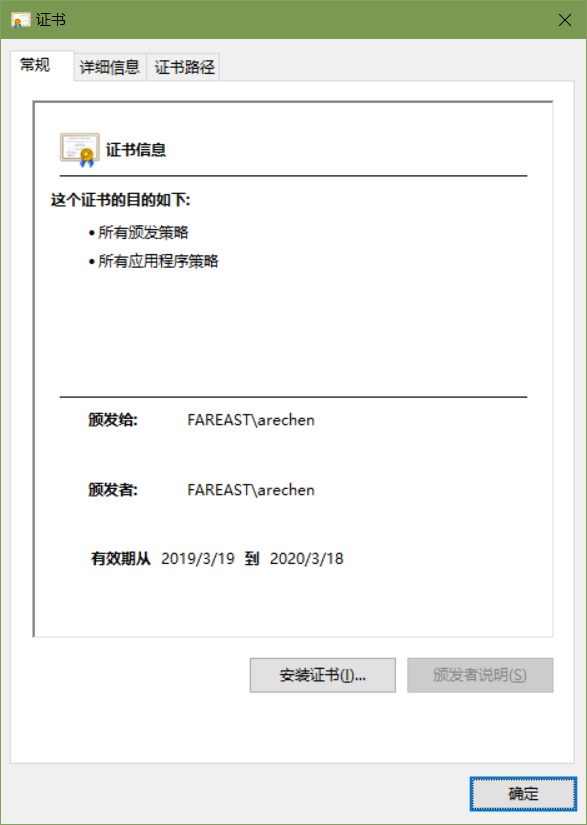
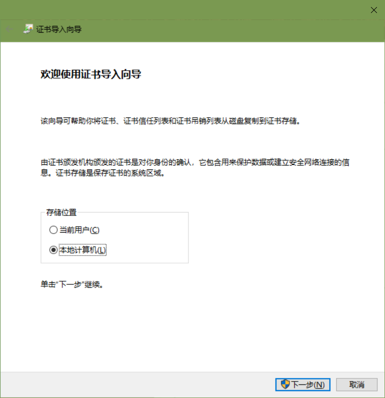
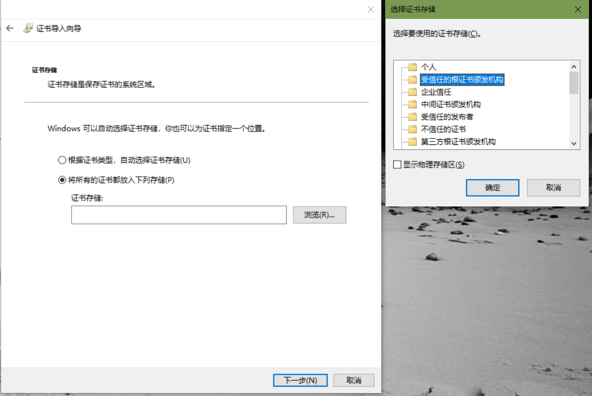
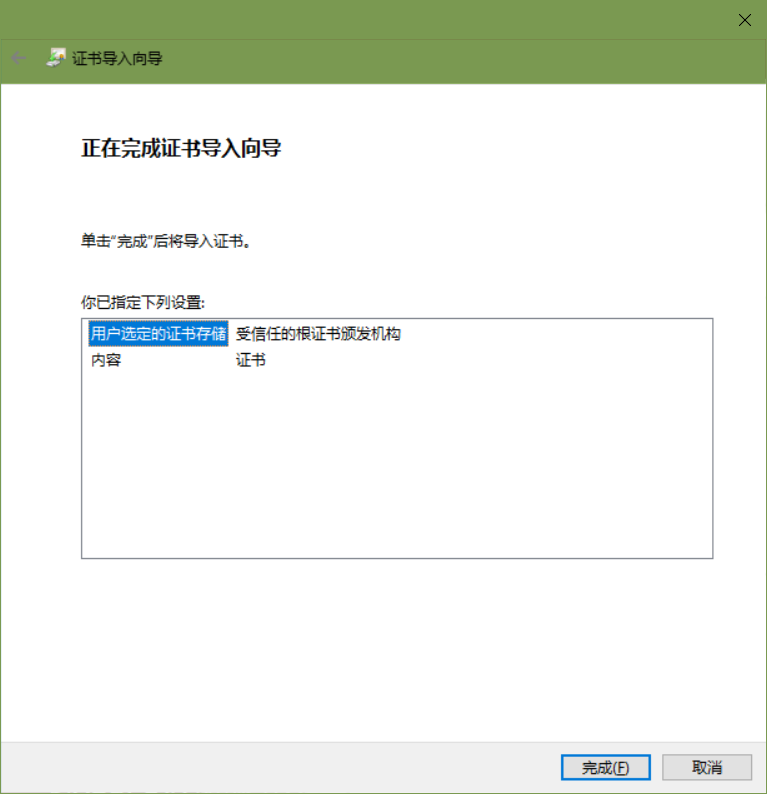

# TingPowerPoint 官方首页

> 陈希章 于 2019年3月

## 项目概述

这个是我发起的一个在Office 365客户端和现有服务中进行人工智能应用创新项目的一部分。这是一个基于VSTO技术开发的PowerPoint插件，希望能为PowerPoint带来语音方面的体验。这个想法有几个出发点

1. 为文档增加语音后，可以使得收到你的PPT的用户不仅仅可以看，也可以听，就好像你在现场跟他讲述一样。
1. 为视力不好的用户提供帮助，他们可以听文档的内容。
1. 通过自然语言技术，为你的文档提供更加易于被聆听的声音，而且不是让人倦怠的纯机器声音。
1. 可以批量生成语音文档。
1. 可以实现自定义语音，例如把你的声音合成进去，但是又不需要你亲自朗读。

## 如何安装

1. 你需要首先安装一个证书，请通过下载 [证书](/resources/aioffice.cer) 在本地进行安装，请参考如下的步骤：

    

    点击“安装证书”按钮

    

    选择“本地计算机”，然后点击“下一步”

    

    选择“将所有的证书都放在下列存储”，然后点击“浏览”按钮，然后选择“受信任的根证书颁发机构”，然后点击“确定”按钮，回到证书导入向导后，点击“下一步”按钮

    

    点击“完成”按钮

1. 你可以通过下载 [安装程序](/resources/installer.exe) 在本地完成插件的安装。

## 如何试用

## 如何更新

这个插件使用了自动更新技术，你每次打开PowerPoint时它就会自动检测服务器端是否有最新版本，然后帮助你完成更新。

## 隐私声明

为了帮助我们改进产品设计，该插件会收集一些匿名的数据，包括点击菜单按钮的顺序，以及当前PowerPoint的版本信息。这些数据不包含任何跟你个人有关的信息。

另外，因为需要用到在云端的人工智能服务，所以你在幻灯片的备注区域的文字会被发送到Azure认知服务API层，在插件层不会做任何保存。

## 欢迎推荐

如果你用的还不错，非常希望你能推荐给周围的朋友试用， 请通过 <https://forms.office.com/Pages/ResponsePage.aspx?id=v4j5cvGGr0GRqy180BHbR9NNufPMIKNJmM6xKHZY6M9UMVRRUVBBSkhMTEM0ME5BT0lLRUQwU01QVC4u> 填写相关信息，我会发送邮件给你的朋友，帮助他试用。

## 欢迎反馈

我非常希望得到大家的反馈意见，请通过 <https://forms.office.com/Pages/ResponsePage.aspx?id=v4j5cvGGr0GRqy180BHbR9NNufPMIKNJmM6xKHZY6M9UODlKWUg0MkJLQTlGSFdGU05KUjAzQURVNS4u> 这里提交你的意见和建议，谢谢！